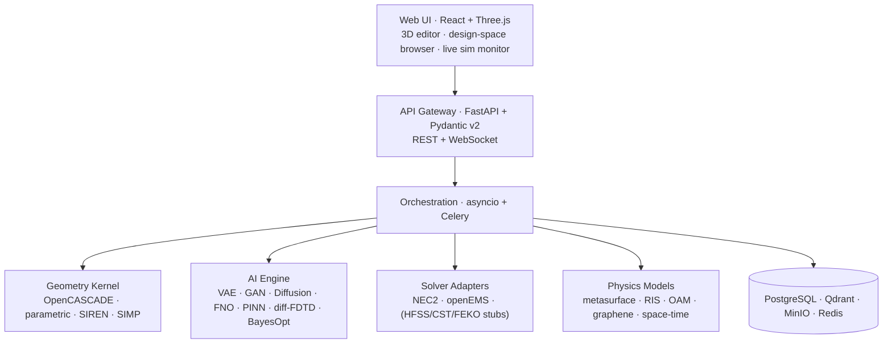

<div align="center">

# ⚡ YAF — Source Sequence Antenna Forge

**An open, auditable platform for AI-guided antenna exploration, optimization, and solver-backed evidence.**

[](https://www.python.org/downloads/)
[](LICENSE)
[](pyproject.toml)
[](https://github.com/astral-sh/ruff)
[](CONTRIBUTING.md)

[English](README.md) · [简体中文](README.zh-CN.md)

</div>

---

> [!IMPORTANT]
> **GOAI semifinal reviewers:** start with the audited final package at
> [`docs/submission/SUBMISSION-README.md`](docs/submission/SUBMISSION-README.md).
> The public repository is a deliberately sanitized root snapshot: it contains the final code,
> reports, and **255/255** SHA-256 evidence ledger, but no original commit/tree chronology or
> excluded prompt/config blobs from the private 144-commit research history. The frozen verdict is
> **`insufficient_evidence`**.

## GOAI semifinal audited snapshot

> The result is a **NEC2-only paired-state computational study**, not a new-antenna invention,
> a manufacturable design, or a dual-solver-confirmed candidate.

- A frozen B-parent conditional-completion study completed 20/20 runs and 6,000 accepted
  evaluations. It observed **H1/H2 = 702/0**: paired-state validity occurred, but no record crossed
  the preregistered numerical effect line.
- A separate preregistered, counterfactual-only A-span probe produced 10/10 monotonic responses
  and 32/32 NEC2 subprocess calls. It diagnoses an active search-space boundary; it is not an H1/H2
  result and does not change the verdict.
- Candidate openEMS confirmation was not authorized: the bounded rod-r2 instrument gate ended
  `repair_not_confirmed` with zero parseable voltage/current samples.
- The current ledger verifies **255/255** archived runs by SHA-256.

### Ten-minute, solver-free reviewer path

From a clean clone with Python 3.11 or newer. The minimal review dependencies do not include NEC2
or openEMS, and the commands below do not run either solver:

```powershell
python -m venv .venv-review
.venv-review\Scripts\python.exe -m pip install -r requirements-semifinal.txt
.venv-review\Scripts\python.exe scripts/archive_run.py --verify
.venv-review\Scripts\python.exe scripts/semifinal_public_snapshot_verify.py
```

Expected evidence lines include:

```text
solver_calls=0
history_mode=sanitized_root_snapshot
original_history_replay=not_available
archive_verify=255/255 OK
b_completion_h1_h2=702/0
a_span_probe_solver_calls=32
a_span_probe_monotonic=10/10
support_certificate=480002/480002 OK
final_verdict=insufficient_evidence
```

Full instructions: [`docs/semifinal-reproducibility.md`](docs/semifinal-reproducibility.md).
The publication receipt is
[`docs/provenance/PUBLIC-SNAPSHOT-RECEIPT.json`](docs/provenance/PUBLIC-SNAPSHOT-RECEIPT.json).
Original commit IDs in reports are provenance labels only; their objects are intentionally absent
from this public Git history so deleted local tool state and historical prompt transcripts cannot
be recovered from GitHub.

Designing an antenna today means a human expert iterating in HFSS/CST for weeks.
**YAF inverts that loop**: you declare *what* you want (frequency band, gain,
polarization, size budget), and a pipeline of generative models, differentiable
electromagnetics, neural-operator surrogates, and classical solvers searches the
design space for you.

```
      spec ──▶ generate ──▶ screen ──▶ refine ──▶ verify ──▶ score ──┐
       ▲      (VAE/GAN/     (FNO       (diff.     (real NEC2 MoM /   │
       │       diffusion)   surrogate)  FDTD ∇)    openEMS FDTD)     │
       └────────── active learning (GP on real solver scores) ◀─────┘
```

Supported verification paths run **real electromagnetics**: fixture-covered dipoles,
patches, and planar pixel geometries can go through openEMS FDTD / NEC2 MoM, with
S-parameters and selected far-field transforms checked against official solver APIs.
That is component-level validation, not blanket candidate confirmation: every geometry and
renderer must pass its own instrument gate, and a design counts as *converged* only when its
declared real-solver criteria pass.

## Why YAF?

- 🤖 **Text-to-antenna agent** — chat with a DeepSeek-backed assistant that
  can dispatch installed openEMS/NEC2 adapters and keeps `solver_mode` visible;
  an output is evidence only when the relevant instrument gate passes.
- ⚡ **Real physics oracle** — self-built openEMS toolchain (simulation XML,
  port DFT, NF2FF far field) with fixture-covered paths checked against the
  official API. NEC2/openEMS agreement is geometry- and renderer-specific;
  historical anchor results never substitute for candidate-level confirmation.
- 🧠 **Differentiable EM core** — a 2D FDTD written in JAX with verified
  end-to-end gradient flow: `∂(S11)/∂(geometry)` for gradient-based inverse design.
- 🎨 **Generative-design scaffolding** — β-VAE / GAN / diffusion modules can propose
  geometries; supported planar candidates can be rasterized for solver evaluation.
  Validation scope is tracked explicitly in
  [`docs/HONEST_STATUS.md`](docs/HONEST_STATUS.md).
- 🔌 **Solver-agnostic** — one `SolverAdapter` protocol; NEC2 (MoM) and openEMS
  (FDTD) adapters included, HFSS/CST/FEKO/COMSOL/MEEP stubs ready for adapters.
- 📡 **Exotic physics built in** — metasurfaces, RIS (reconfigurable intelligent
  surfaces), OAM, graphene, and space-time modulated antennas as first-class models.
- 🏗️ **Production-shaped architecture** — FastAPI + WebSocket, Celery workers,
  PostgreSQL/Qdrant/MinIO, React + Three.js frontend, one-command Docker Compose.
- 🔬 **Radical honesty** — every simulation result is labeled with its
  `solver_mode` (`native` / `subprocess` / `fallback_analytical`), convergence
  requires a real-solver label, and [`docs/HONEST_STATUS.md`](docs/HONEST_STATUS.md)
  audits, line by line, which parts are physically validated and which are
  scaffolding. No silent fake physics — ever.

## General platform quickstart (not semifinal evidence)

### 30 seconds, no solver install required

```bash
git clone https://github.com/1ove9/yaf-goai-semifinal yaf && cd yaf
pip install -e .

yaf demo dipole      # half-wave dipole → S11 / VSWR / gain
yaf demo fdtd        # differentiable FDTD: watch gradients flow
yaf demo bayesian    # GP + Expected Improvement on antenna tuning
yaf info             # show which solvers/backends are available on this machine
```

> ⚠️ Without `nec2c` / openEMS installed, solvers fall back to closed-form
> analytical models. Results are clearly labeled `fallback_analytical` and are
> **pipeline demos, not EM ground truth**. Set `YAF_NO_FALLBACK=1` to make
> missing solvers a hard error instead. Real-solver setup: [docs/next-steps.md](docs/next-steps.md)
> (CI builds openEMS v0.0.36 from source — see `.github/workflows/ci.yml` for
> the exact Ubuntu recipe).

### Chat with the design agent

```bash
export DEEPSEEK_API_KEY=sk-...   # server-side only, never sent to the browser
yaf serve                        # backend on :8000
pnpm -C frontend dev             # UI on :5173 → "AI Assistant" tab
```

With a compatible solver installation, the agent can dispatch tool calls such as
`simulate_patch`, `simulate_dipole`, and `run_inverse_design`. Results retain their
`solver_mode`, and physical claims remain conditional on the relevant instrument and
candidate gates. This general workflow does not upgrade the GOAI semifinal verdict.

### Full stack (API + workers + frontend)

```bash
cp .env.example .env
docker compose up -d
curl http://localhost:8000/health     # → {"status":"ok","version":"0.1.0"}
open http://localhost:5173            # React + Three.js UI
```

### Design an antenna via API

```bash
curl -X POST http://localhost:8000/api/v1/designs \
  -H "Content-Type: application/json" \
  -d '{
    "name": "wifi_dipole",
    "frequency_range": [2.4e9, 2.5e9],
    "size_constraint": {"x_min": -0.1, "x_max": 0.1, "y_min": -0.1, "y_max": 0.1, "z_min": -0.1, "z_max": 0.1},
    "polarization": "linear",
    "material_palette": ["copper"]
  }'

curl -X POST http://localhost:8000/api/v1/simulations \
  -H "Content-Type: application/json" \
  -d '{"design_id": "<design-uuid>", "solver": "nec2", "frequency_min": 2400000000, "frequency_max": 2500000000}'
```

## Architecture



| Module | Path | What's inside |
|---|---|---|
| Domain model | `yaf_core/domain/` | Design, Geometry, Simulation, Optimization (Pydantic v2) |
| Ports | `yaf_core/ports/` | `SolverAdapter`, `AIBackend`, `CADBackend` protocols |
| Geometry | `yaf_core/geometry/` | Parametric generators, implicit surfaces (SIREN), topology opt |
| Physics | `yaf_core/physics/` | Metasurface, RIS, OAM, graphene, space-time modulation |
| Solvers | `yaf_solvers/` | NEC2 ★, openEMS ★, MEEP/HFSS/CST/FEKO/COMSOL stubs |
| AI | `yaf_ai/` | Diffusion, VAE, GAN, FNO, DeepONet, PINN, diff-FDTD, BayesOpt, NSGA-II |
| API | `yaf_api/` | FastAPI + WebSocket |
| Workers | `yaf_worker/` | Celery + Redis |
| Storage | `yaf_db/` | PostgreSQL + Qdrant vector store |
| Frontend | `frontend/` | React 18, TypeScript, Vite, Three.js |

## Project status — read this before starring the physics

| Claim | Status |
|---|---|
| Real NEC2 (MoM) end-to-end: wire antennas, S11, far field, gain | ✅ fixture-locked vs real nec2c output |
| Supported openEMS fixture paths: dipole, patch, planar pixel geometries | ✅ locked to stored official-API fixtures on those paths |
| NF2FF far field: gain / efficiency / pattern | ✅ bit-identical to the official transform on the same dumps |
| Cross-solver infrastructure | ⚠️ geometry/renderer-specific; the semifinal paired candidate was not authorized for openEMS confirmation |
| Inverse-design pipeline with real physics oracle | ✅ `converged` requires a real-solver label |
| Active-learning feedback (GP on real scores) | ✅ fallback scores are never learned from |
| Dispersive substrates (Drude/Lorentz) | ✅ known-answer test; Debye **refused** (no engine support in v0.0.36) |
| AI design agent (DeepSeek function-calling → real solvers) | ✅ honesty rules enforced in results + prompt |
| Physical accuracy on machines without nec2c/openEMS | ❌ analytical fallback, clearly labeled |
| Non-planar meshes (horns: need waveguide ports), trained FNO surrogates | 🚧 roadmap |
| Manufacturing export (Gerber/STEP) | 🚧 roadmap |

Full audit: [`docs/HONEST_STATUS.md`](docs/HONEST_STATUS.md) ·
Dependency-ordered roadmap: [`docs/next-steps.md`](docs/next-steps.md)

We believe an honest scaffold beats a rigged demo. Core real-solver subprocess paths are
implemented, but instrument release remains geometry-specific and is not a blanket scientific
confirmation. Physics-grounded training data and additional calibrated render paths remain
high-impact contributions — see [CONTRIBUTING.md](CONTRIBUTING.md).

## Verification

The following are developer checks, separate from the solver-free semifinal reviewer path
above:

```bash
docker compose up -d                                          # infra up
curl -fsS http://localhost:8000/health                        # 200 OK
pytest tests/ -q                                              # full current test suite
python -m yaf_ai.differentiable.diff_fdtd_jax --demo          # "✓ Gradient flow verified"
python -m yaf_ai.generative.vae_designer --train --epochs 2   # weights → models/vae_designer.pt
python scripts/demo_dipole.py                                 # S11 / VSWR / gain report
mypy yaf_core yaf_ai yaf_solvers yaf_api yaf_db yaf_worker --strict
```

## Tech stack

Python 3.11+ · FastAPI · Pydantic v2 · JAX/Flax/Optax · PyTorch 2 · NumPy/SciPy ·
Celery + Redis · PostgreSQL 16 · Qdrant · MinIO · React 18 + TypeScript + Three.js ·
Docker Compose

## Roadmap

- **Phase A** — ✅ **core infrastructure implemented (2026-08)** — openEMS + nec2c
  subprocess paths, NF2FF far field, pixel-geometry rasterization, dispersive materials,
  and known-answer regression fixtures; each new renderer and scientific candidate still
  requires its own calibration and release gate
- **Phase B** — physics-grounded AI: 10⁴-sample simulated dataset, FNO surrogate screening, conditional VAE, 3D/CPML differentiable FDTD
- **Phase C** — manufacturing: DfM constraints, Gerber/STEP export, fab-and-measure active-learning loop
- **Phase D** — platform: real DB/queue wiring, frontend redesign, auth, observability
- **Phase E** — invention: benchmark suite vs. published designs, novelty scoring against prior art

Details: [`docs/next-steps.md`](docs/next-steps.md)

## Contributing

All contributions welcome — solver adapters, physics validation, AI models, docs,
frontend. Start with [CONTRIBUTING.md](CONTRIBUTING.md) and the
[`good first issue`](../../labels/good%20first%20issue) label.

## Citation

If YAF is useful in your research, please cite it (see [CITATION.cff](CITATION.cff)).

## License

### Origin, contribution, and third-party disclosure

| Component | Role and contribution boundary | Version used or disclosed | License and distribution boundary |
|---|---|---|---|
| [Antenna Forge](https://github.com/1ove9/antenna-forge) | Predecessor codebase by the same creator. This submission inherits the basic YAF domain models, solver-adapter/API/worker/frontend scaffolding, general AI modules, and project structure. | Repository lineage; the sanitized public snapshot does not claim an exact upstream commit. | MIT. Reusing the predecessor in this MIT repository is license-compatible. |
| This GOAI semifinal repository | Adds the preregistration and decision chain, freeform/meander and paired-state exploration spaces, frozen scoring/search studies, instrument gates, dual-solver audit work, SHA-256 evidence manifest, 255 archived runs, terminal analyses, and public snapshot verifier. | [`goai-semifinal-2026-09-03`](https://github.com/1ove9/yaf-goai-semifinal/tree/goai-semifinal-2026-09-03) | MIT for repository-authored source. |
| DeepSeek API | Optional chat/orchestration service for the general platform. It is not required for the solver-free review path and did **not** generate, replace, tune, or edit electromagnetic curves or archived scientific numbers. | External API; no model/API version is frozen as scientific evidence. | Commercial service under DeepSeek's terms; no DeepSeek model or service code is bundled. |
| [nec2c](https://github.com/KJ7LNW/nec2c) | Local subprocess search/reference instrument for NEC2 wire calculations. | The archive records `subprocess` mode but not the executable build identifier; this is a disclosed reproducibility limitation. | GPL-3.0-only upstream. Not bundled or redistributed here; users install it separately. |
| [openEMS](https://github.com/thliebig/openEMS) | Independent FDTD instrument, used only on paths authorized by their preregistered instrument gates. | 0.0.36 in archived output. | GPL-3.0-or-later upstream. Not bundled or relicensed by this MIT repository. |
| [CSXCAD](https://github.com/thliebig/CSXCAD) | Geometry/material library used by the openEMS path. | 0.6.3 in archived output. | LGPL-3.0-or-later upstream. Not bundled or relicensed here. |
| Minimal Python review stack | Runs the solver-free 255-entry evidence and terminal-fact checks. | Validated environment: Pydantic 2.13.4; NumPy 2.4.6; SciPy 1.17.1; structlog 26.1.0; Matplotlib 3.11.1; Pillow 12.3.0. Install ranges are frozen in [`requirements-semifinal.txt`](requirements-semifinal.txt). | Pydantic: MIT; NumPy/SciPy core: BSD-3-Clause (wheels may contain separately licensed components); structlog: MIT OR Apache-2.0; Matplotlib: Matplotlib License (PSF-based); Pillow: HPND. Each dependency retains its upstream license. |

The repository's MIT license applies only to the MIT-licensed predecessor and repository-authored
source; it does not relicense separately installed GPL/LGPL solvers or third-party packages.
Downstream distributors must comply with each upstream license. This disclosure is not legal advice.
The scientific and AI-role boundaries are detailed in
[`docs/semifinal-compliance.md`](docs/semifinal-compliance.md).

Created by [1ove9](https://github.com/1ove9) · GOAI team: `source sequence` ·
[MIT](LICENSE) © 2026 1ove9
