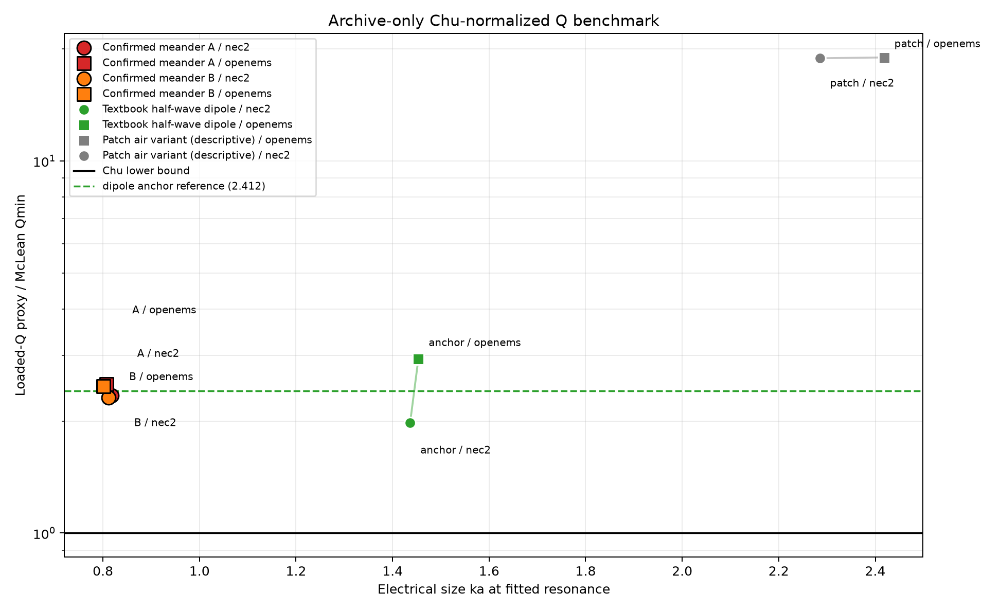

# Chu--Harrington benchmark over archived designs

This is a zero-simulation analysis. Every Q value is a magnitude-only loaded-Q proxy and carries its source run, method, fit window, R2, bandwidth cross-check, and bin diagnostic. Definitions are frozen in `docs/chu-benchmark-method.md`.

## Main table (high-confidence and physically consistent only)

| design | solver | source | a mm | alternate a mm | f0 GHz | ka | Q RLC | Q FBW | R2 | Qmin | Q/Qmin | vs anchor | fit pts | bin % | combined uncertainty | flags |
|---|---|---|---:|---:|---:|---:|---:|---:|---:|---:|---:|---:|---:|---:|---:|---|
| Confirmed meander A | nec2 | `day5-wire-v6-final-crosscheck-top1` (`nec2`) | 15.159570 | 21.213203 | 2.573503626 | 0.817656 | 7.154948 | 7.139925 | 0.995811 | 3.052318 | 2.344103 | -18.35% | 38 | 0.389% | 2.88% | none |
| Confirmed meander A | openems | `day5-wire-v6-final-crosscheck-top1` (`openems`) | 15.159570 | 21.213203 | 2.541381900 | 0.807451 | 7.891525 | 8.185988 | 0.992858 | 3.138021 | 2.514809 | +14.42% | 33 | 0.393% | 3.41% | none |
| Confirmed meander B | nec2 | `day5-wire-v6-final-crosscheck-top2` (`nec2`) | 14.905607 | 21.213203 | 2.597944009 | 0.811594 | 7.169270 | 7.184638 | 0.995994 | 3.102757 | 2.310613 | -16.66% | 38 | 0.385% | 2.87% | none |
| Confirmed meander B | openems | `day5-wire-v6-final-crosscheck-top2` (`openems`) | 14.905607 | 21.213203 | 2.564459965 | 0.801133 | 7.909735 | 8.209278 | 0.992623 | 3.193080 | 2.477149 | +15.70% | 33 | 0.390% | 3.39% | none |
| Textbook half-wave dipole | nec2 | `day4-dipole-anchor` (`nec2`) | 30.591067 | n/a | 2.240356539 | 1.436385 | 2.047246 | 2.050139 | 0.954923 | 1.033625 | 1.980648 | n/a | 86 | 0.580% | 2.13% | none |
| Textbook half-wave dipole | openems | `day4-dipole-anchor` (`openems`) | 30.591067 | n/a | 2.266984307 | 1.453457 | 2.978648 | 2.958086 | 0.980089 | 1.013696 | 2.938403 | n/a | 61 | 0.573% | 2.17% | none |
| Patch air variant (descriptive) | openems | `day5-patch-final-openems-2x-mesh-recheck` (`curve`) | 23.408376 | 40.901865 | 4.929043747 | 2.418205 | 9.193423 | 9.101097 | 0.996429 | 0.484246 | 18.985013 | n/a | 12 | 1.109% | 10.20% | none |
| Patch air variant (descriptive) | nec2 | `day5-patch-final-nec2-grid44` (`point.curve`) | 23.408376 | 40.901865 | 4.657510853 | 2.284990 | 9.848576 | 9.761933 | 0.999459 | 0.521459 | 18.886596 | n/a | 10 | 1.172% | 11.46% | none |

## Interpretation

- The textbook dipole anchor ratios are nec2=1.981, openems=2.938; the plot reference is their geometric mean, 2.412.
- Confirmed meander A: nec2: ka=0.818, Q/Qmin=2.344, anchor delta=-18.4%, openems: ka=0.807, Q/Qmin=2.515, anchor delta=+14.4%.
- Confirmed meander A remains well above the preregistered 1.5 proximity threshold. The finite search budget and score, which did not optimize bandwidth or Q, are relevant scope limits rather than excuses to relabel it.
- Confirmed meander B: nec2: ka=0.812, Q/Qmin=2.311, anchor delta=-16.7%, openems: ka=0.801, Q/Qmin=2.477, anchor delta=+15.7%.
- Confirmed meander B remains well above the preregistered 1.5 proximity threshold. The finite search budget and score, which did not optimize bandwidth or Q, are relevant scope limits rather than excuses to relabel it.
- Patch rows are descriptive only: assigning the finite ground to the Chu sphere materially changes ka and the bound, so no strong patch-limit conclusion is made.

## Appendix-only rows

| design | solver | source | status/error | R2 | fit points | Q RLC | Q FBW | flags |
|---|---|---|---|---:|---:|---:|---:|---|

## Complete fit and sampling diagnostics

| design | solver | method | samples | fit window | crossings GHz | bin MHz | BW MHz | Q SE | QFBW interval | alternate ka / Qmin / ratio |
|---|---|---|---:|---:|---|---:|---:|---:|---|---|
| Confirmed meander A | nec2 | `rlc_reflected_power_proxy` | 201 | 90--127 (38) | 2.406890733 / 2.767329197 | 10.000000 | 360.438464 | 0.056178 | 6.947183--7.343668 | 1.144169 / 1.541617 / 4.641197 |
| Confirmed meander A | openems | `rlc_reflected_power_proxy` | 201 | 89--121 (33) | 2.392989489 / 2.703444625 | 10.000000 | 310.455136 | 0.087671 | 7.930539--8.458441 | 1.129888 / 1.578300 / 5.000016 |
| Confirmed meander B | nec2 | `rlc_reflected_power_proxy` | 201 | 93--130 (38) | 2.430742696 / 2.792339743 | 10.000000 | 361.597047 | 0.055215 | 6.991293--7.388981 | 1.155035 / 1.514729 / 4.733038 |
| Confirmed meander B | openems | `rlc_reflected_power_proxy` | 201 | 91--123 (33) | 2.414598448 / 2.726984008 | 10.000000 | 312.385560 | 0.088899 | 7.954637--8.480762 | 1.140148 / 1.551787 / 5.097178 |
| Textbook half-wave dipole | nec2 | `rlc_reflected_power_proxy` | 101 | 2--87 (86) | 1.834617557 / 2.927400124 | 13.000000 | 1092.782568 | 0.036137 | 2.026037--2.074822 | n/a |
| Textbook half-wave dipole | openems | `rlc_reflected_power_proxy` | 101 | 11--71 (61) | 1.950706402 / 2.717074915 | 13.000000 | 766.368513 | 0.040315 | 2.908745--3.009131 | n/a |
| Patch air variant (descriptive) | openems | `rlc_reflected_power_proxy` | 51 | 10--21 (12) | 4.672054511 / 5.213642380 | 54.640547 | 541.587868 | 0.138983 | 8.267039--10.122335 | 4.225372 / 0.249921 / 36.785268 |
| Patch air variant (descriptive) | nec2 | `rlc_reflected_power_proxy` | 51 | 6--15 (10) | 4.427332271 / 4.904441775 | 54.600000 | 477.109504 | 0.064070 | 8.759503--11.023446 | 3.992603 / 0.266175 / 37.000358 |

## Method limitations

S11 bandwidth mixes radiator Q, mismatch, and feed behavior. The curves are near-lossless, which aligns better with the Chu efficiency assumption, but the result remains a loaded-Q proxy. The patch-plus-ground sphere is especially interpretation-sensitive. No row below Q/Qmin=1 is promoted; such a value diagnoses proxy/model/sampling inconsistency.

