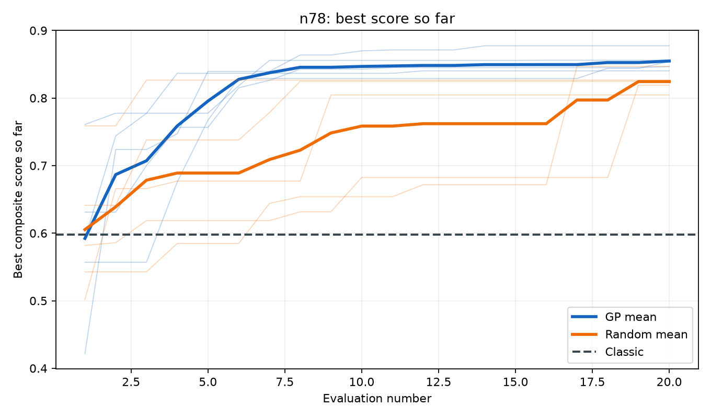
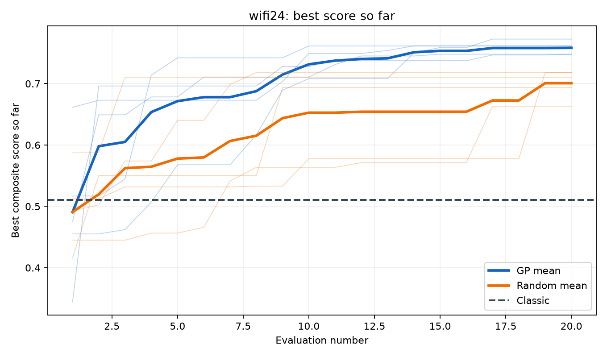
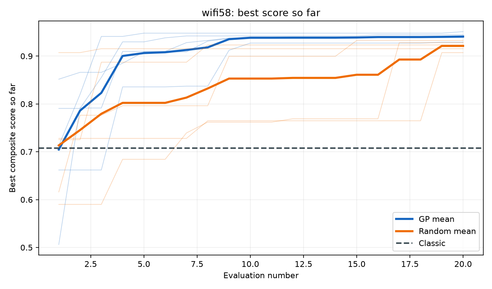

# Batch day2: GP vs random

## Scope and evidence limits

This batch reports descriptive statistics across n=5 matched seeds. It does not perform or claim statistical significance.
All Day 2 runs use openEMS subprocess physics. Cross-solver verification is pending for every spec, so no result is labeled a positive discovery.
The frozen batch config hash is `4e1d59771f329eaa98bfd08c7ccb1b3c8782028ff0bab38c53d1befd07b3fc7d`; budget=20, seeds=[101, 202, 303, 404, 505], proposal space=`patch-v2-4d`.
wifi24 retains the Day 1 spec field-for-field. Its Day 2 run config hashes differ from Day 1 `6996470edd01ad8c2a2141dc07172064fef74efcf8184a4651968a0b153851f7` because the proposal-space version and boundaries are now included, and the budgets/seeds differ.

## Per-seed traceable results

| Spec | Seed | GP best | Random best | GP-Random | GP source | Random source |
|---|---:|---:|---:|---:|---|---|
| n78 | 101 | 0.877378 | 0.826593 | +0.050785 | `day2-n78-gp-s101` | `day2-n78-random-s101` |
| n78 | 202 | 0.840266 | 0.819032 | +0.021234 | `day2-n78-gp-s202` | `day2-n78-random-s202` |
| n78 | 303 | 0.855949 | 0.804591 | +0.051358 | `day2-n78-gp-s303` | `day2-n78-random-s303` |
| n78 | 404 | 0.846529 | 0.846831 | -0.000303 | `day2-n78-gp-s404` | `day2-n78-random-s404` |
| n78 | 505 | 0.854014 | 0.824857 | +0.029157 | `day2-n78-gp-s505` | `day2-n78-random-s505` |
| wifi24 | 101 | 0.747982 | 0.710489 | +0.037493 | `day2-wifi24-gp-s101` | `day2-wifi24-random-s101` |
| wifi24 | 202 | 0.747990 | 0.718143 | +0.029846 | `day2-wifi24-gp-s202` | `day2-wifi24-random-s202` |
| wifi24 | 303 | 0.761596 | 0.693561 | +0.068035 | `day2-wifi24-gp-s303` | `day2-wifi24-random-s303` |
| wifi24 | 404 | 0.761406 | 0.663289 | +0.098118 | `day2-wifi24-gp-s404` | `day2-wifi24-random-s404` |
| wifi24 | 505 | 0.772617 | 0.718082 | +0.054535 | `day2-wifi24-gp-s505` | `day2-wifi24-random-s505` |
| wifi58 | 101 | 0.938440 | 0.915450 | +0.022990 | `day2-wifi58-gp-s101` | `day2-wifi58-random-s101` |
| wifi58 | 202 | 0.951106 | 0.907207 | +0.043899 | `day2-wifi58-gp-s202` | `day2-wifi58-random-s202` |
| wifi58 | 303 | 0.940965 | 0.932633 | +0.008332 | `day2-wifi58-gp-s303` | `day2-wifi58-random-s303` |
| wifi58 | 404 | 0.944619 | 0.927952 | +0.016667 | `day2-wifi58-gp-s404` | `day2-wifi58-random-s404` |
| wifi58 | 505 | 0.929101 | 0.923240 | +0.005862 | `day2-wifi58-gp-s505` | `day2-wifi58-random-s505` |

## Descriptive aggregates

| Spec | Agent | Mean best +/- sample SD | Relative to classic | Sources |
|---|---|---:|---:|---|
| n78 | gp | 0.854827 ± 0.014066 | +42.99% | `day2-n78-gp-s101`, `day2-n78-gp-s202`, `day2-n78-gp-s303`, `day2-n78-gp-s404`, `day2-n78-gp-s505`; classic `day2-n78-classic-s0` |
| n78 | random | 0.824381 ± 0.015243 | +37.90% | `day2-n78-random-s101`, `day2-n78-random-s202`, `day2-n78-random-s303`, `day2-n78-random-s404`, `day2-n78-random-s505`; classic `day2-n78-classic-s0` |
| wifi24 | gp | 0.758318 ± 0.010467 | +48.63% | `day2-wifi24-gp-s101`, `day2-wifi24-gp-s202`, `day2-wifi24-gp-s303`, `day2-wifi24-gp-s404`, `day2-wifi24-gp-s505`; classic `day2-wifi24-classic-s0` |
| wifi24 | random | 0.700713 ± 0.023199 | +37.34% | `day2-wifi24-random-s101`, `day2-wifi24-random-s202`, `day2-wifi24-random-s303`, `day2-wifi24-random-s404`, `day2-wifi24-random-s505`; classic `day2-wifi24-classic-s0` |
| wifi58 | gp | 0.940846 ± 0.008112 | +32.98% | `day2-wifi58-gp-s101`, `day2-wifi58-gp-s202`, `day2-wifi58-gp-s303`, `day2-wifi58-gp-s404`, `day2-wifi58-gp-s505`; classic `day2-wifi58-classic-s0` |
| wifi58 | random | 0.921296 ± 0.010115 | +30.22% | `day2-wifi58-random-s101`, `day2-wifi58-random-s202`, `day2-wifi58-random-s303`, `day2-wifi58-random-s404`, `day2-wifi58-random-s505`; classic `day2-wifi58-classic-s0` |

## Discovery-policy assessment

| Spec | GP >= classic threshold | Matched outcomes | Cross-solver | Verdict |
|---|---|---|---|---|
| n78 | yes (+42.99%, threshold 10%) | GP 4, random 1, ties 0 | pending | insufficient_evidence |
| wifi24 | yes (+48.63%, threshold 10%) | GP 5, random 0, ties 0 | pending | insufficient_evidence |
| wifi58 | yes (+32.98%, threshold 10%) | GP 5, random 0, ties 0 | pending | insufficient_evidence |

### Interpretation

- **n78:** Descriptive evidence is not a stable negative signal, and positive discovery remains blocked pending cross-solver verification.
- **wifi24:** Descriptive evidence is not a stable negative signal, and positive discovery remains blocked pending cross-solver verification.
- **wifi58:** Descriptive evidence is not a stable negative signal, and positive discovery remains blocked pending cross-solver verification.

## Best-so-far curves

