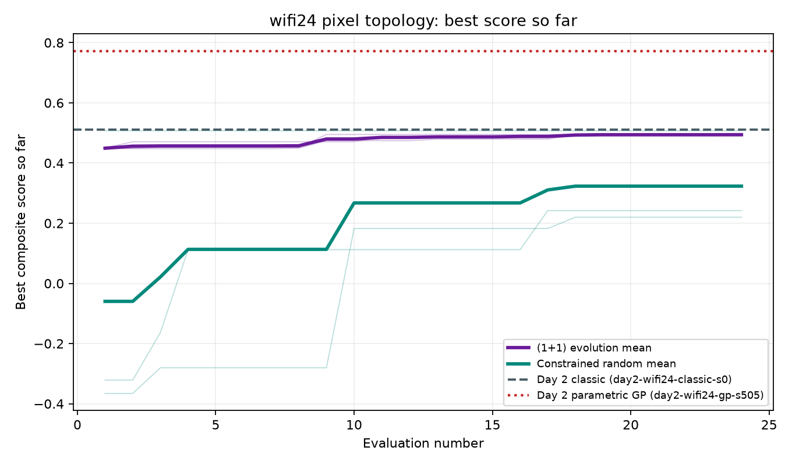
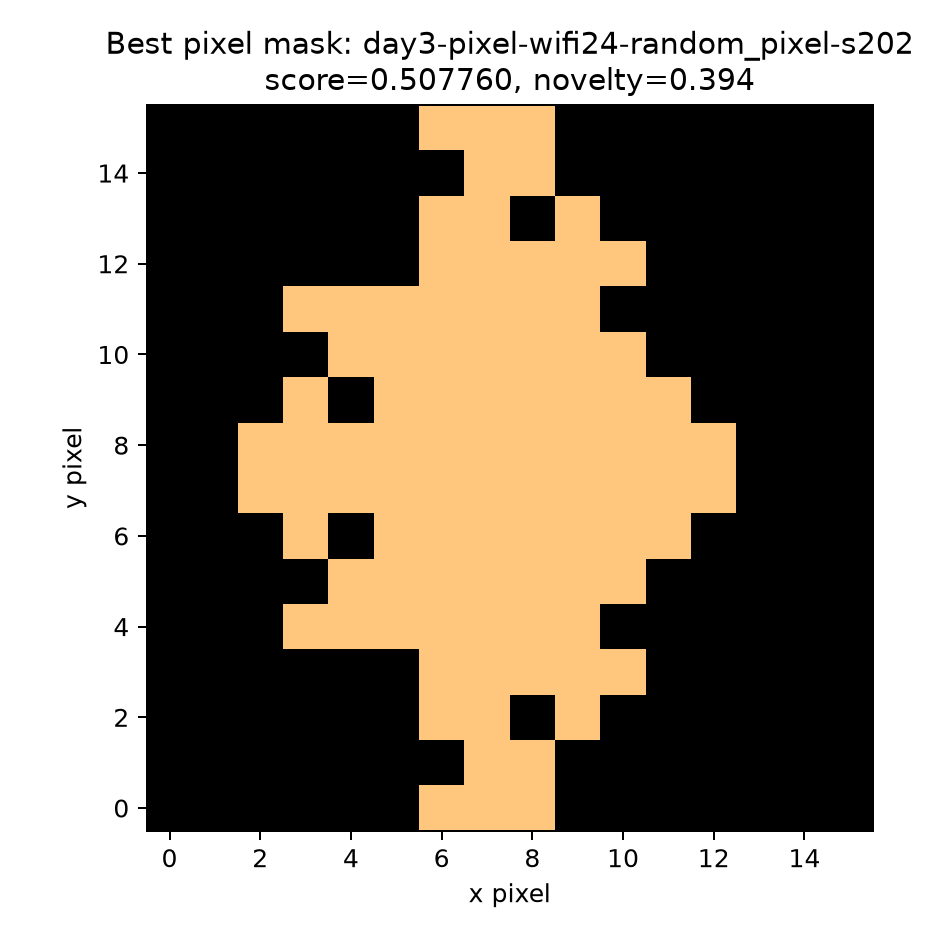

# Batch day3-pixel: wifi24 pixel topology

## Frozen scope

This descriptive comparison uses seeds [101, 202, 303] and budget=24 after a measured preflight. All accepted evaluations must be openEMS subprocess runs; no significance test is claimed.
The proposal space is `pixel-wifi24-v1-16x16` with a 16x16 grid and minimum feature 2.909 mm.

## Matched results

| Seed | Evolution best | Random best | Difference | Sources |
|---:|---:|---:|---:|---|
| 101 | 0.490861 | 0.220083 | +0.270778 | `day3-pixel-wifi24-evolve_pixel-s101`, `day3-pixel-wifi24-random_pixel-s101` |
| 202 | 0.494857 | 0.507760 | -0.012903 | `day3-pixel-wifi24-evolve_pixel-s202`, `day3-pixel-wifi24-random_pixel-s202` |
| 303 | 0.496781 | 0.241717 | +0.255064 | `day3-pixel-wifi24-evolve_pixel-s303`, `day3-pixel-wifi24-random_pixel-s303` |

## Descriptive aggregates

| Agent | Mean best +/- sample SD | Source runs |
|---|---:|---|
| evolve_pixel | 0.494166 +/- 0.003020 | `day3-pixel-wifi24-evolve_pixel-s101`, `day3-pixel-wifi24-evolve_pixel-s202`, `day3-pixel-wifi24-evolve_pixel-s303` |
| random_pixel | 0.323187 +/- 0.160211 | `day3-pixel-wifi24-random_pixel-s101`, `day3-pixel-wifi24-random_pixel-s202`, `day3-pixel-wifi24-random_pixel-s303` |

## Direct answers

1. **Can pixel topology exceed classic? no.** The best pixel score is 0.507760 from `day3-pixel-wifi24-random_pixel-s202` versus 0.510190 from `day2-wifi24-classic-s0`.
2. **Does it approach or exceed the Day 2 parametric GP best?** Reached 95%: no; exceeded: no. The best pixel score is 65.72% of 0.772617 from `day2-wifi24-gp-s505`.
3. **How different is the best mask?** IoU with the frozen classic rectangle is 0.606; novelty `1-IoU` is 0.394.

These are topology-exploration outcomes, not a claim that a new antenna was invented.

## Curves and topology

