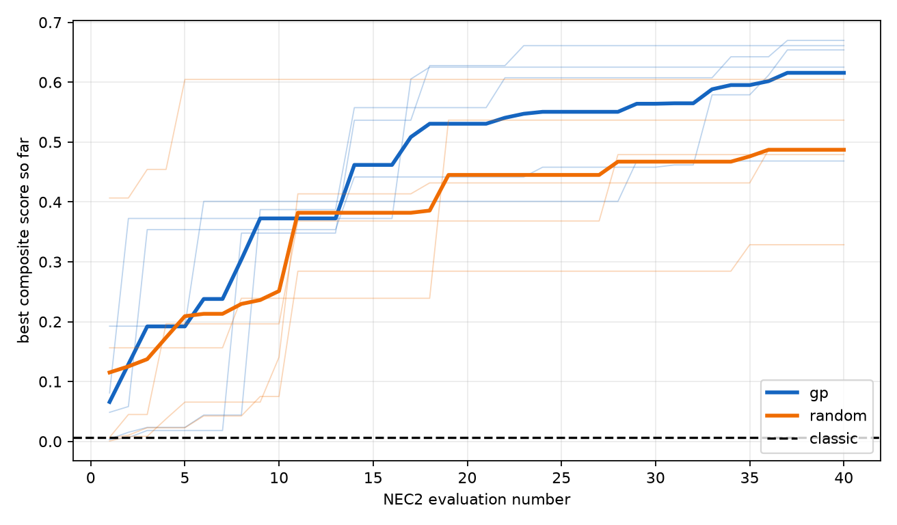
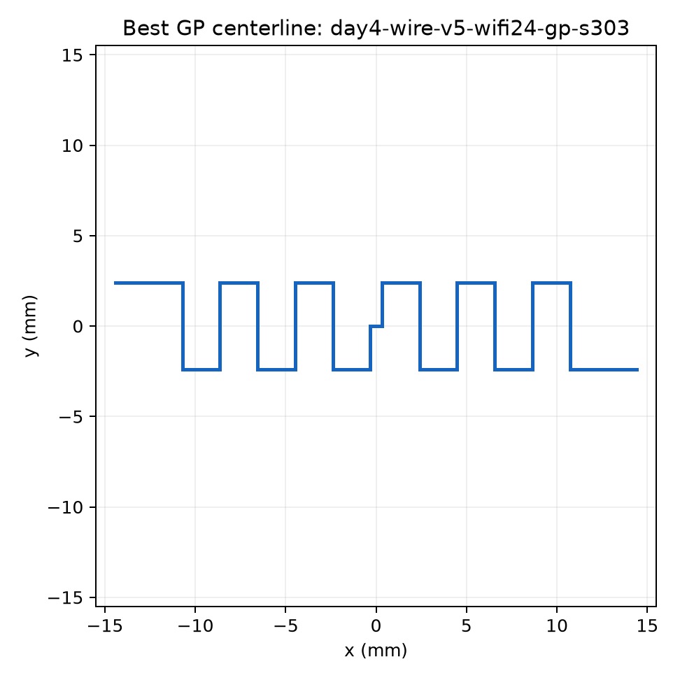

# Day 4.5 native wire exploration: day4-wire-v5

This replacement analysis follows the retraction in `artifacts/analysis/day4-wire/RETRACTION.md`; no Day 4 v4 numeric result is reused as valid performance evidence.

## Scope

The scientific question is whether GP can find a planar meander dipole that outperforms the longest axis-aligned straight dipole in the frozen 30x30 mm box. NEC2 is the exploration oracle; openEMS is an independent native-centerline verifier under protocol v2.1.
The batch config hash is `172e1ca95dce2a5b55a9fff611f84ec3a4ee708f37daa36b2befb8f3f8339f8d`. Results are descriptive over five matched seeds; no significance claim is made.

## Matched-seed comparison

| seed | GP best | Random best | GP-Random | GP source | Random source |
|---:|---:|---:|---:|---|---|
| 101 | 0.653948 | 0.486868 | +0.167081 | `day4-wire-v5-wifi24-gp-s101` | `day4-wire-v5-wifi24-random-s101` |
| 202 | 0.661130 | 0.328475 | +0.332655 | `day4-wire-v5-wifi24-gp-s202` | `day4-wire-v5-wifi24-random-s202` |
| 303 | 0.669771 | 0.479049 | +0.190722 | `day4-wire-v5-wifi24-gp-s303` | `day4-wire-v5-wifi24-random-s303` |
| 404 | 0.468367 | 0.604608 | -0.136241 | `day4-wire-v5-wifi24-gp-s404` | `day4-wire-v5-wifi24-random-s404` |
| 505 | 0.625114 | 0.536626 | +0.088488 | `day4-wire-v5-wifi24-gp-s505` | `day4-wire-v5-wifi24-random-s505` |

## Aggregates and straight reference

Classic score: 0.006711 from `day4-wire-v5-wifi24-classic-s0`.

| agent | mean best +/- sample SD | relative to classic | sources |
|---|---:|---:|---|
| gp | 0.615666 +/- 0.084033 | +9073.48% | `day4-wire-v5-wifi24-gp-s101`, `day4-wire-v5-wifi24-gp-s202`, `day4-wire-v5-wifi24-gp-s303`, `day4-wire-v5-wifi24-gp-s404`, `day4-wire-v5-wifi24-gp-s505` |
| random | 0.487125 +/- 0.101843 | +7158.21% | `day4-wire-v5-wifi24-random-s101`, `day4-wire-v5-wifi24-random-s202`, `day4-wire-v5-wifi24-random-s303`, `day4-wire-v5-wifi24-random-s404`, `day4-wire-v5-wifi24-random-s505` |

GP beat matched random in 4/5 seeds; its mean best score was +26.39% relative to random. These are descriptive matched-seed results, not a significance claim.
The percentage ratios against classic are not interpreted as effect sizes because the corrected classic score is close to zero; the absolute scores and RF metrics are the meaningful comparison.

## Best-design RF sanity

| source | min S11 dB | best VSWR | accepted-power gain dBi | realized gain dBi |
|---|---:|---:|---:|---:|
| `day4-wire-v5-wifi24-gp-s101` | -4.689062 | 3.7943 | 2.510000 | 0.707422 |
| `day4-wire-v5-wifi24-gp-s202` | -5.481128 | 3.2739 | 1.960000 | 0.514794 |
| `day4-wire-v5-wifi24-gp-s303` | -4.727058 | 3.7652 | 2.620000 | 0.836841 |
| `day4-wire-v5-wifi24-gp-s404` | -3.158210 | 5.5610 | 2.200000 | -0.667262 |
| `day4-wire-v5-wifi24-gp-s505` | -4.830430 | 3.6885 | 2.120000 | 0.388396 |
| `day4-wire-v5-wifi24-random-s101` | -3.340603 | 5.2641 | 2.180000 | -0.523353 |
| `day4-wire-v5-wifi24-random-s202` | -1.870380 | 9.3237 | 2.570000 | -1.990223 |
| `day4-wire-v5-wifi24-random-s303` | -3.276472 | 5.3647 | 2.170000 | -0.589503 |
| `day4-wire-v5-wifi24-random-s404` | -4.375646 | 4.0537 | 2.320000 | 0.346918 |
| `day4-wire-v5-wifi24-random-s505` | -3.771536 | 4.6782 | 2.230000 | -0.132805 |

The largest accepted-power gain is 2.620000 dBi from `day4-wire-v5-wifi24-gp-s303`; after terminal mismatch, the largest realized gain is 0.836841 dBi from `day4-wire-v5-wifi24-gp-s303`. Lossless NEC2 efficiency is recorded but has zero score weight.

## Native cross-solver checks

| source | openEMS min (GHz, index, dB) | NEC2 min (GHz, index, dB) | gap | Pearson | verdict |
|---|---:|---:|---:|---:|---|
| `day4-wire-v5-wifi24-gp-s303` | 2.850000, 135, -8.658940 | 2.530000, 103, -4.987638 | n/a | n/a | NO_RESONANCE_IN_BAND (`day4-wire-v5-crosscheck-top1`) |
| `day4-wire-v5-wifi24-gp-s202` | 2.890000, 139, -8.639588 | 2.550000, 105, -5.740552 | n/a | n/a | NO_RESONANCE_IN_BAND (`day4-wire-v5-crosscheck-top2`) |

## Verdict

`insufficient_evidence`: protocol v2.1 returned `NO_RESONANCE_IN_BAND` for `day4-wire-v5-crosscheck-top1`, `day4-wire-v5-crosscheck-top2`. Agreement gap and Pearson were therefore not computed, and no improvement is confirmed.

## Test skip audit

Day 3's six skips were the three tests in the real-NEC2 class and the three tests in the two-solver validation class. Their `skipif` guards are evaluated at collection time; the non-elevated managed shell could not create a WSL instance (`E_ACCESSDENIED`), so NEC2 appeared absent there even though experiment commands were run with the required WSL permission. In the current acceptance run, that permission is present at collection time and all six execute. This is a process-permission difference, not a scientific test defect; no skip guard was changed.

