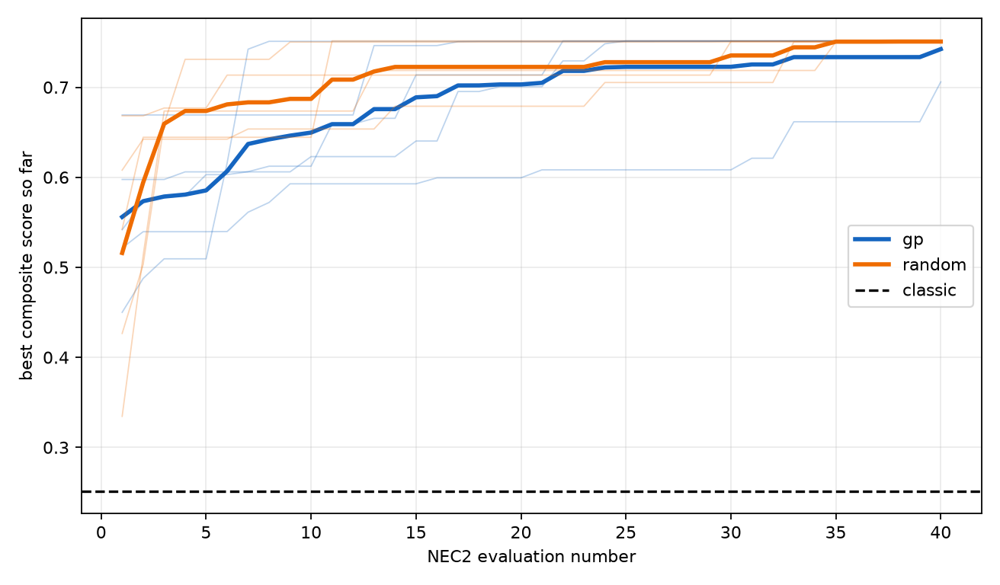
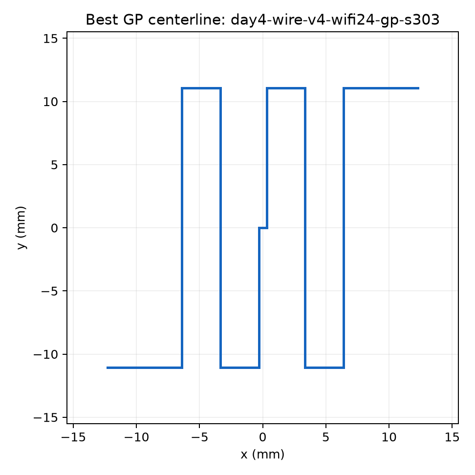

# Day 4 native wire exploration

## Scope

The scientific question is whether GP can find a planar meander dipole that outperforms the longest axis-aligned straight dipole in the frozen 30x30 mm box. NEC2 is the exploration oracle; openEMS is an independent native-centerline verifier under protocol v2.
The batch config hash is `985d537e30a407aef6123d019634d00c249a1644ab0fea8eace35075f4411753`. Results are descriptive over five matched seeds; no significance claim is made.

## Matched-seed comparison

| seed | GP best | Random best | GP-Random | GP source | Random source |
|---:|---:|---:|---:|---|---|
| 101 | 0.751374 | 0.750184 | +0.001190 | `day4-wire-v4-wifi24-gp-s101` | `day4-wire-v4-wifi24-random-s101` |
| 202 | 0.751234 | 0.750382 | +0.000852 | `day4-wire-v4-wifi24-gp-s202` | `day4-wire-v4-wifi24-random-s202` |
| 303 | 0.751578 | 0.750851 | +0.000726 | `day4-wire-v4-wifi24-gp-s303` | `day4-wire-v4-wifi24-random-s303` |
| 404 | 0.705952 | 0.751516 | -0.045564 | `day4-wire-v4-wifi24-gp-s404` | `day4-wire-v4-wifi24-random-s404` |
| 505 | 0.751516 | 0.750800 | +0.000715 | `day4-wire-v4-wifi24-gp-s505` | `day4-wire-v4-wifi24-random-s505` |

## Aggregates and straight reference

Classic score: 0.251327 from `day4-wire-v4-wifi24-classic-s0`.

| agent | mean best +/- sample SD | relative to classic | sources |
|---|---:|---:|---|
| gp | 0.742331 +/- 0.020337 | +195.36% | `day4-wire-v4-wifi24-gp-s101`, `day4-wire-v4-wifi24-gp-s202`, `day4-wire-v4-wifi24-gp-s303`, `day4-wire-v4-wifi24-gp-s404`, `day4-wire-v4-wifi24-gp-s505` |
| random | 0.750747 +/- 0.000514 | +198.71% | `day4-wire-v4-wifi24-random-s101`, `day4-wire-v4-wifi24-random-s202`, `day4-wire-v4-wifi24-random-s303`, `day4-wire-v4-wifi24-random-s404`, `day4-wire-v4-wifi24-random-s505` |

GP beat matched random in 4/5 seeds, but its mean best score was -1.12% relative to random because of the lower seed-404 result. Therefore this batch does not establish a GP-over-random mean advantage; the confirmed verdict below is specifically improvement over the frozen straight reference.

## Native cross-solver checks

| source | oracle improvement | openEMS f_res GHz | NEC2 f_res GHz | gap | Pearson | verdict |
|---|---:|---:|---:|---:|---:|---|
| `day4-wire-v4-wifi24-gp-s303` | +199.04% | 2.400000 | 2.400000 | 0.000% | 0.993573 | CONFIRMED (`day4-wire-v4-crosscheck-top1`) |
| `day4-wire-v4-wifi24-gp-s505` | +199.02% | 2.400000 | 2.400000 | 0.000% | 0.999417 | CONFIRMED (`day4-wire-v4-crosscheck-top2`) |

Caveat: the sampled minimum for at least one verified curve is at a sweep boundary. The frozen v2 rule still applies mechanically, but the physical resonance outside the wifi24 band is interval-censored; a zero sampled-frequency gap is not infinite precision.

## Verdict

`confirmed_improvement`: GP found a constrained meander dipole that outperformed the box-straight reference by 199.04% in the NEC2 exploration score, and the same native centerline passed protocol v2 in two independent solvers. This is not a claim that a new antenna was invented.

## Test skip audit

Day 3's six skips were the three tests in the real-NEC2 class and the three tests in the two-solver validation class. Their `skipif` guards are evaluated at collection time; the non-elevated managed shell could not create a WSL instance (`E_ACCESSDENIED`), so NEC2 appeared absent there even though experiment commands were run with the required WSL permission. In the current acceptance run, that permission is present at collection time and all six execute. This is a process-permission difference, not a scientific test defect; no skip guard was changed.

