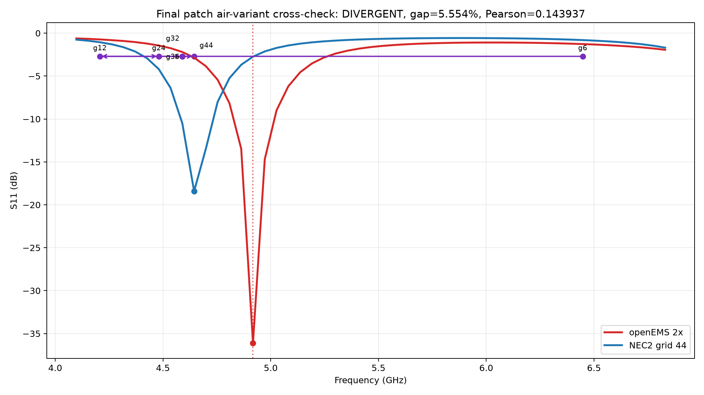
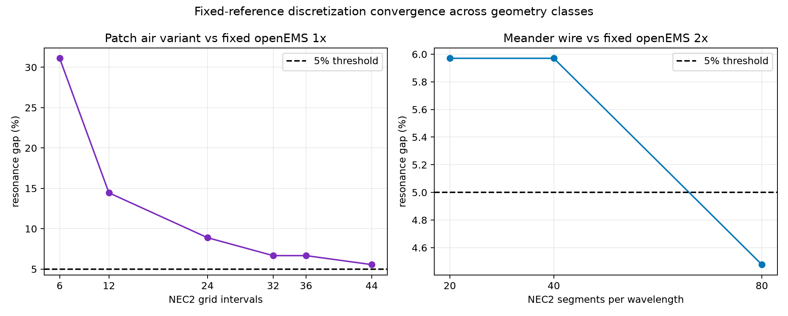

# Day 5-2 final patch cross-check

## Outcome

Final protocol-v2.1 verdict: `DIVERGENT`. Day 2 wifi24 resolved verdict: `insufficient_evidence`. The unique candidate and the pre-registered 4.098041023--6.830068372 GHz / 51-point sweep were not changed; no grid beyond 44 and no retry were used.

No Day 2 upgrade statement is permitted: the unique final comparison is DIVERGENT. Wifi24 remains `insufficient_evidence`.

## Complete decision

| solver | source | minimum | index / samples | interior | depth <= -6 dB |
|---|---|---:|---:|---|---|
| openEMS 2x | `day5-patch-final-openems-2x` | 4.917649 GHz / -36.107923 dB | 15 / 51 | True | True |
| NEC2 grid 44 | `day5-patch-final-nec2-grid44` | 4.644500 GHz / -18.411526 dB | 10 / 51 | True | True |

Resonance difference is 5.554467% (threshold <=5%, met: False); Pearson is 0.143937019 (threshold >=0.8, met: False). S11-depth difference is 17.696397 dB and remains record-only.

## Attribution and compute roadmap

The fixed-reference grid gap narrows monotonically from 31.111425% at grid 6 to 5.554467% at grid 44. This retains the Day 4 `instrument_boundary` attribution, but the completed ladder has not crossed the final agreement gates. The all-point power-law roadmap estimates grid 48 for 5%; the frozen wire-reference Pearson mapping estimates grid 94. The latter is descriptive and potentially optimistic: the measured patch Pearson at grid 44 is only 0.143937019, showing that cross-geometry gap-to-correlation transfer is weak. Neither estimate authorizes an unregistered extra run.

## Day 2 context and scope

The archived five-seed wifi24 GP mean is 0.758318 +/- 0.010467; Random is 0.700713 +/- 0.023199. GP remains 48.63% above classic, but its sole cross-solver gap is unresolved. Wifi58 and n78 remain `inconclusive_needs_spec_specific_grid_study`. Existing Day 2/3/4 artifacts are not modified.

Pre-registered scope text (not activated as a confirmation claim): "Performance values for the original FR4 design remain openEMS results; the cross-check tests the credibility of openEMS for this geometry class."

Full timing and fixed-reference method comparison are in `convergence.md`.

