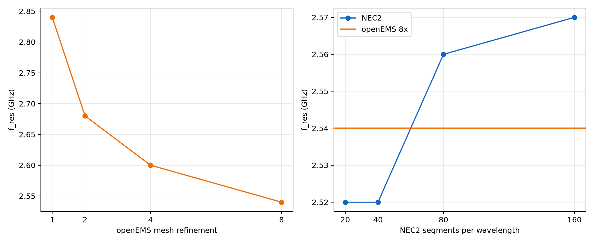

# Day 5-1b instrument convergence

Candidate A is frozen to `day5-wire-v6r2-wifi24-gp-s202` step 255. The protocol-v2.1 scientific thresholds and 1.5--3.5 GHz / 201-point sweep are unchanged.

## Complete sequence

| Solver | Setting | f_res | S11 | wall/recorded time | Solver time | Source |
|---|---:|---:|---:|---:|---:|---|
| openEMS | 1x | 2.840 GHz | -9.594407 dB | 4.078000 s | 4.078000 s | `day5-wire-v6r2-convergence-top1` |
| openEMS | 2x | 2.680 GHz | -7.887229 dB | 4.078000 s | 4.078000 s | `day5-wire-v6r2-convergence-top1` |
| openEMS | 4x | 2.600 GHz | -6.950317 dB | 16.303176 s | 16.297000 s | `day5-wire-v6-final-convergence-stage1` |
| openEMS | 8x | 2.540 GHz | -7.889784 dB | 29.529607 s | 29.516000 s | `day5-wire-v6-final-convergence-stage2-openems-8x` |
| NEC2 | lambda/20 | 2.520 GHz | -6.369480 dB | 0.515000 s | 0.515000 s | `day5-wire-v6r2-convergence-top1`; gap to final openEMS 0.787402% |
| NEC2 | lambda/40 | 2.520 GHz | -6.546960 dB | 0.547000 s | 0.547000 s | `day5-wire-v6r2-convergence-top1`; gap to final openEMS 0.787402% |
| NEC2 | lambda/80 | 2.560 GHz | -6.531863 dB | 0.922000 s | 0.922000 s | `day5-wire-v6r2-convergence-top1`; gap to final openEMS 0.787402% |
| NEC2 | lambda/160 | 2.570 GHz | -6.591915 dB | 4.975203 s | 1.750000 s | `day5-wire-v6-final-convergence-stage1`; gap to final openEMS 1.181102% |

## Frozen decisions

openEMS adjacent shifts were 5.970149%, 3.076923%, 2.362205%. The 2x->4x shift missed 3%, mechanically triggering the single feasible 8x run; 4x->8x passed.
NEC2 lambda/80->lambda/160 shifted 0.389105%, passing the unchanged 3% instrument-convergence check.
Against final openEMS 8x, the NEC2 lambda/20, /40, /80, /160 gaps are 0.787402%, 0.787402%, 0.787402%, and 1.181102%. The last increase violates the preregistered monotonic-narrowing condition even though both instruments individually converge and the final gap is below 5%.
Attribution verdict: `infeasible_at_current_compute`. This label is applied before the final candidate verdicts and is not changed based on their outcome.

