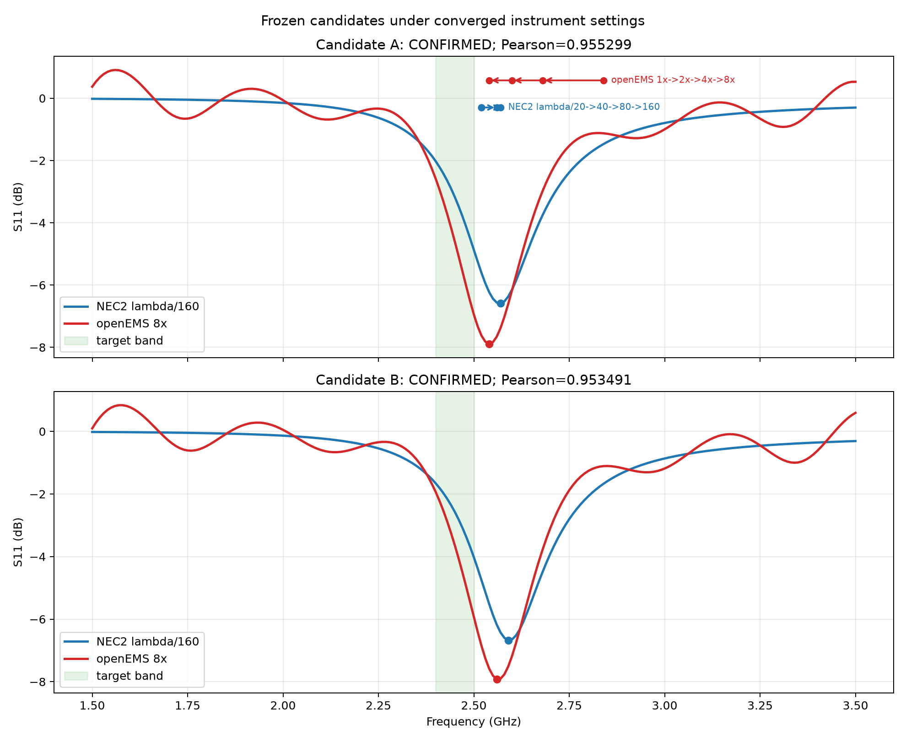

# Day 5-1b final converged-instrument cross-check

## Outcome

Environment verdict: `confirmed_improvement`. Both frozen candidates are reported below; no third candidate and no outcome-driven retry were used. The protocol v2.1 thresholds and 1.5--3.5 GHz / 201-point sweep remained unchanged.

> GP 探索发现的盒约束弯折偶极子（总线长 81.512 mm），经收敛性验证的 NEC2（λ/160）与 openEMS（8× 网格）双原生求解器按预注册 v2.1 判据确认：f_res 偏差 1.181%、Pearson 0.955299、收敛仪器下 NEC2/openEMS 带内最深 S11 -4.869/-6.944 dB。相对参照：盒内直偶极子（分数 0.006711，极低，百分比不作效应量）与随机搜索基线（5-seed 最佳分均值 0.631748；GP 为 0.701272）。

The confirmation is specifically a protocol-v2.1 cross-solver agreement result. The converged-instrument minima remain slightly above the 2.40--2.50 GHz target band, so the table reports the final in-band S11 explicitly rather than implying perfect center tuning.

## Frozen candidates

| candidate | source / step | total line length | archived selection-band S11 | final NEC2 / openEMS in-band S11 |
|---|---|---:|---:|---:|
| A | `day5-wire-v6r2-wifi24-gp-s202` / 255 | 81.512 mm | -6.128246 dB | -4.868900 / -6.944287 dB |
| B | `day5-wire-v6r2-wifi24-gp-s202` / 253 | 80.982 mm | -6.175477 dB | -4.020245 / -5.929551 dB |

## Instrument convergence

| solver | setting | f_res | S11 | wall time | solver time | source |
|---|---:|---:|---:|---:|---:|---|
| openEMS | 1x | 2.840 GHz | -9.594407 dB | 4.078000 s | 4.078000 s | `day5-wire-v6r2-convergence-top1` |
| openEMS | 2x | 2.680 GHz | -7.887229 dB | 4.078000 s | 4.078000 s | `day5-wire-v6r2-convergence-top1` |
| openEMS | 4x | 2.600 GHz | -6.950317 dB | 16.303176 s | 16.297000 s | `day5-wire-v6-final-convergence-stage1` |
| openEMS | 8x | 2.540 GHz | -7.889784 dB | 29.529607 s | 29.516000 s | `day5-wire-v6-final-convergence-stage2-openems-8x` |
| NEC2 | lambda/20 | 2.520 GHz | -6.369480 dB | 0.515000 s | 0.515000 s | `day5-wire-v6r2-convergence-top1`; gap to final openEMS 0.787402% |
| NEC2 | lambda/40 | 2.520 GHz | -6.546960 dB | 0.547000 s | 0.547000 s | `day5-wire-v6r2-convergence-top1`; gap to final openEMS 0.787402% |
| NEC2 | lambda/80 | 2.560 GHz | -6.531863 dB | 0.922000 s | 0.922000 s | `day5-wire-v6r2-convergence-top1`; gap to final openEMS 0.787402% |
| NEC2 | lambda/160 | 2.570 GHz | -6.591915 dB | 4.975203 s | 1.750000 s | `day5-wire-v6-final-convergence-stage1`; gap to final openEMS 1.181102% |

openEMS adjacent shifts: 5.970149%, 3.076923%, and 2.362205%; the final adjacent shift passes the frozen 3% gate. NEC2 lambda/80->lambda/160 shifted 0.389105%, also passing. The NEC2 gaps to final openEMS are 0.787402%, 0.787402%, 0.787402%, and 1.181102%; the final increase fails the preregistered monotonic-narrowing clause. Therefore the independently frozen attribution remains `infeasible_at_current_compute` even though the final candidate decisions below pass.

## Final protocol-v2.1 decisions

| candidate/source | openEMS minimum | NEC2 minimum | f gap | Pearson | decision |
|---|---:|---:|---:|---:|---|
| A / `day5-wire-v6r2-wifi24-gp-s202` step 255 | 2.540 GHz, -7.890 dB, index 104 | 2.570 GHz, -6.592 dB, index 107 | 1.181% | 0.955299 | CONFIRMED (`day5-wire-v6-final-crosscheck-top1`) |
| B / `day5-wire-v6r2-wifi24-gp-s202` step 253 | 2.560 GHz, -7.918 dB, index 106 | 2.590 GHz, -6.672 dB, index 109 | 1.172% | 0.953491 | CONFIRMED (`day5-wire-v6-final-crosscheck-top2`) |

All four resonance minima are internal (outside the first/last three samples) and at or below -6 dB. Both frequency gaps pass 5%, and both Pearson correlations pass 0.8. The preregistered rule therefore marks each candidate independently CONFIRMED; either one was predeclared sufficient for the environment-level first confirmed finding.

## Source baseline context

The source `day5-wire-v6r2` five-seed GP mean best score is 0.701272 +/- 0.006407; Random is 0.631748 +/- 0.019289. Classic score is 0.006711 from `day5-wire-v6r2-wifi24-classic-s0`. The classic ratio is not treated as an effect size because the reference score is near zero. These are descriptive statistics, not a significance claim; source run IDs are preserved in `summary.json`.

