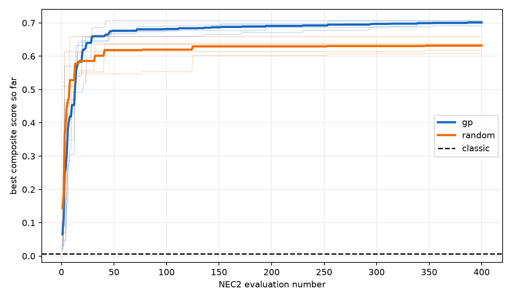
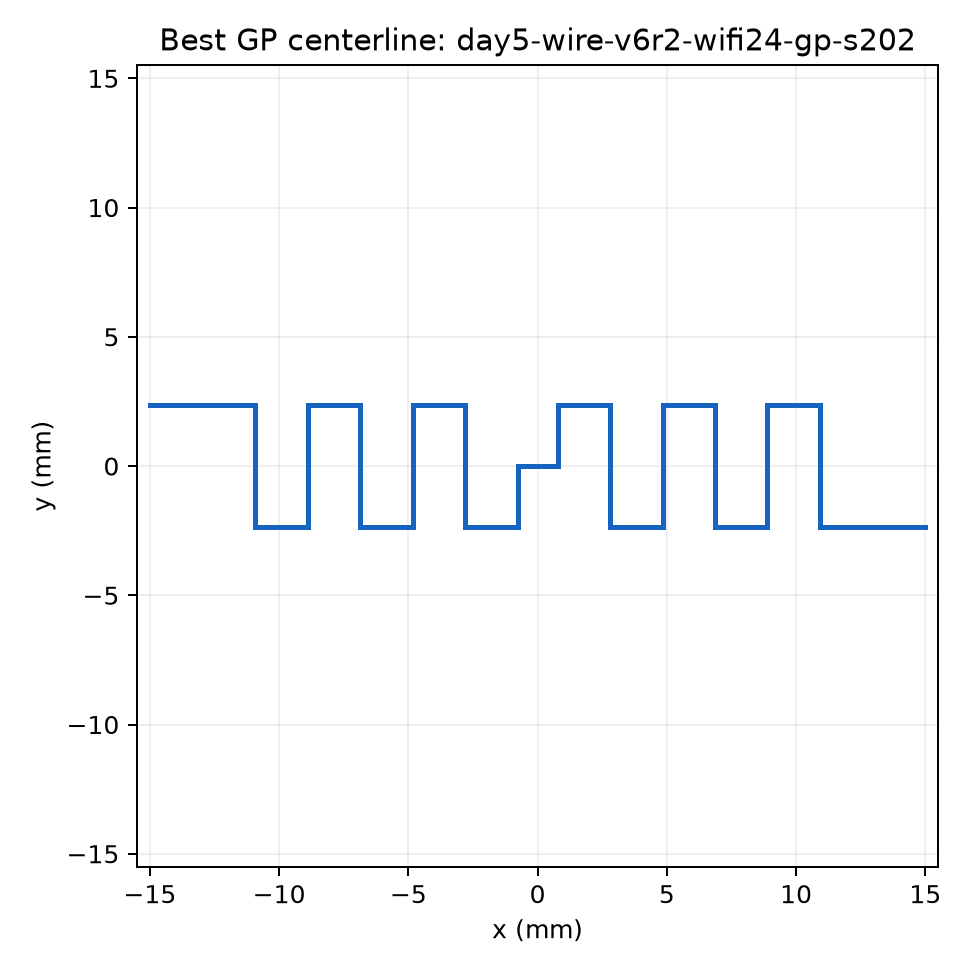
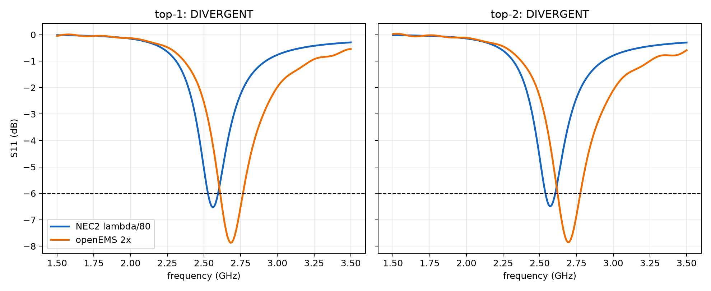
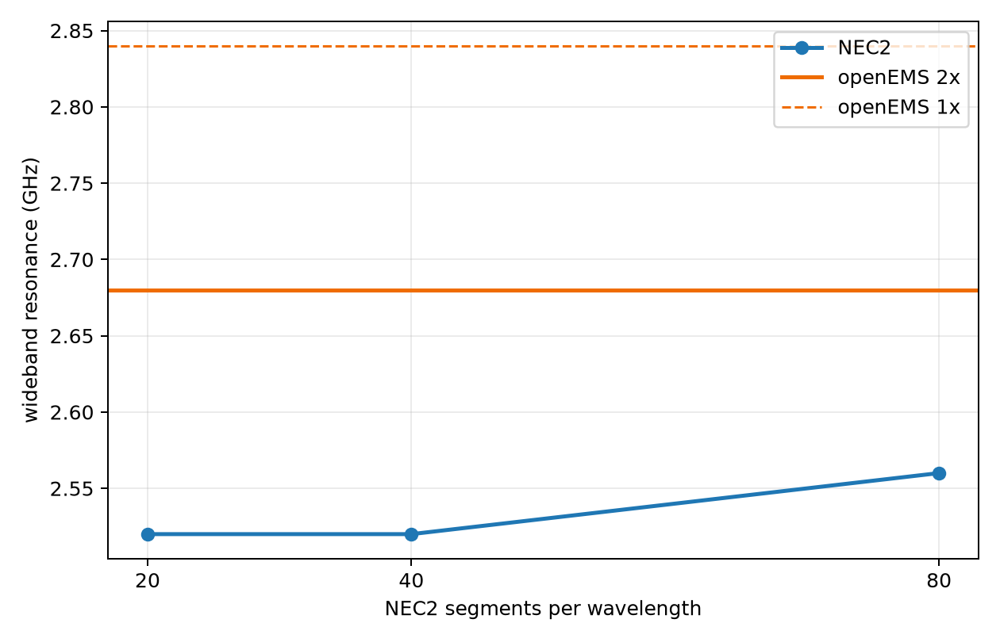

# Day 5 wire exploration v6

## Outcome

The 50--80 mm v2 attempt was stopped by its preregistered sanity check and is documented in `ABORTED_V2.md`. The source-addressed wideband diagnostic justified the separately preregistered 50--100 mm v2.1 retry `day5-wire-v6r2`.
The retry found valid target-band NEC2 designs and GP beat Random in all five matched seeds. Both fixed top designs nevertheless failed the unchanged cross-solver Pearson threshold. Final discovery verdict: `divergent`; `confirmed_improvement` is not permitted.

## Matched-seed matrix

| seed | GP best | Random best | GP-Random | GP source | Random source |
|---:|---:|---:|---:|---|---|
| 101 | 0.703917 | 0.635656 | +0.068260 | `day5-wire-v6r2-wifi24-gp-s101` | `day5-wire-v6r2-wifi24-random-s101` |
| 202 | 0.706172 | 0.637143 | +0.069030 | `day5-wire-v6r2-wifi24-gp-s202` | `day5-wire-v6r2-wifi24-random-s202` |
| 303 | 0.691067 | 0.658824 | +0.032242 | `day5-wire-v6r2-wifi24-gp-s303` | `day5-wire-v6r2-wifi24-random-s303` |
| 404 | 0.706172 | 0.608600 | +0.097572 | `day5-wire-v6r2-wifi24-gp-s404` | `day5-wire-v6r2-wifi24-random-s404` |
| 505 | 0.699030 | 0.618519 | +0.080511 | `day5-wire-v6r2-wifi24-gp-s505` | `day5-wire-v6r2-wifi24-random-s505` |

| batch | GP mean +/- SD | Random mean +/- SD | GP/Random |
|---|---:|---:|---:|
| v5 (budget 40) | 0.615666 +/- 0.084033 | 0.487125 +/- 0.101843 | +26.39% |
| v6r2 (budget 400) | 0.701272 +/- 0.006407 | 0.631748 +/- 0.019289 | +11.00% |

Classic score was 0.006711 from `day5-wire-v6r2-wifi24-classic-s0`. Ratios to this near-zero reference are not treated as effect sizes. The five-seed results are descriptive; no significance claim is made.

## Top-1 segmentation and mesh attribution

Source: `day5-wire-v6r2-wifi24-gp-s202` step 255; convergence run `day5-wire-v6r2-convergence-top1`.

| model | resolution | f_res | S11 | gap to openEMS 2x | time |
|---|---|---:|---:|---:|---:|
| NEC2 | lambda/20 | 2.520 GHz | -6.369 dB | 5.970% | 0.515 s |
| NEC2 | lambda/40 | 2.520 GHz | -6.547 dB | 5.970% | 0.547 s |
| NEC2 | lambda/80 | 2.560 GHz | -6.532 dB | 4.478% | 0.922 s |
| openEMS | 1x | 2.840 GHz | -9.594 dB | n/a | 4.078 s |
| openEMS | 2x | 2.680 GHz | -7.887 dB | reference | 4.078 s |

openEMS shifted 5.970% from 1x to 2x, so its <=3% self-convergence check failed. NEC2 gap ratio was 0.750; the frozen attribution is `inconclusive_needs_finer_segmentation`.

## Protocol v2.1 top-2 cross-check

| rank/source | openEMS minimum | NEC2 minimum | f gap | Pearson | decision |
|---|---:|---:|---:|---:|---|
| 1 / `day5-wire-v6r2-wifi24-gp-s202` step 255 | 2.680 GHz, -7.868 dB, index 118 | 2.560 GHz, -6.532 dB, index 106 | 4.478% | 0.719342 | DIVERGENT (`day5-wire-v6r2-crosscheck-top1`) |
| 2 / `day5-wire-v6r2-wifi24-gp-s101` step 386 | 2.690 GHz, -7.845 dB, index 119 | 2.570 GHz, -6.494 dB, index 107 | 4.461% | 0.718527 | DIVERGENT (`day5-wire-v6r2-crosscheck-top2`) |

Both solvers have valid internal minima deeper than -6 dB, and both frequency gaps pass 5%. Pearson correlations 0.719342 and 0.718527 fail the preregistered 0.8 threshold, so the result is DIVERGENT. Coupled with the failed openEMS mesh self-check and inconclusive segmentation attribution, this is not the first effective CONFIRMED result.

