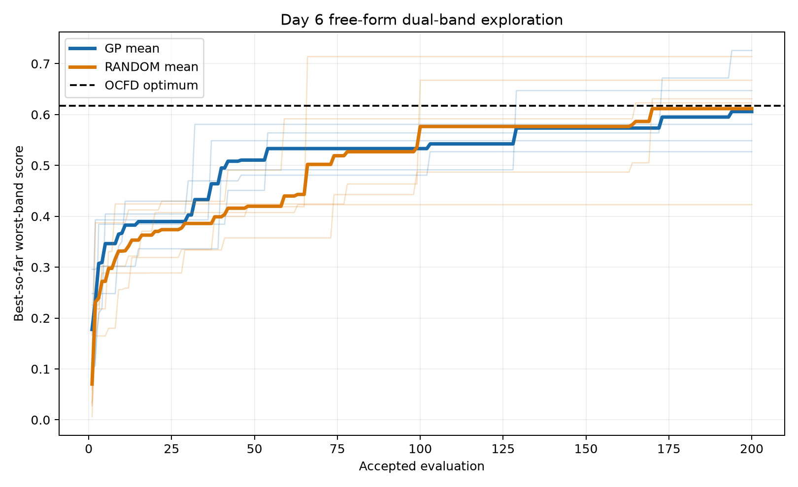
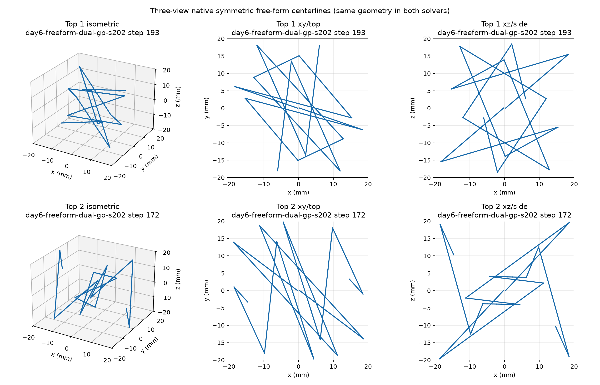
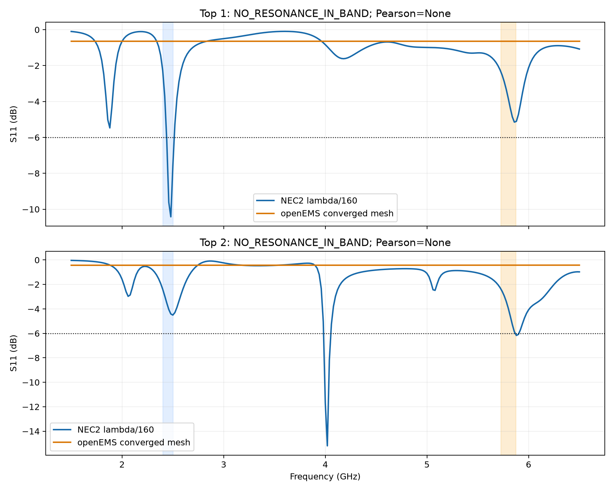
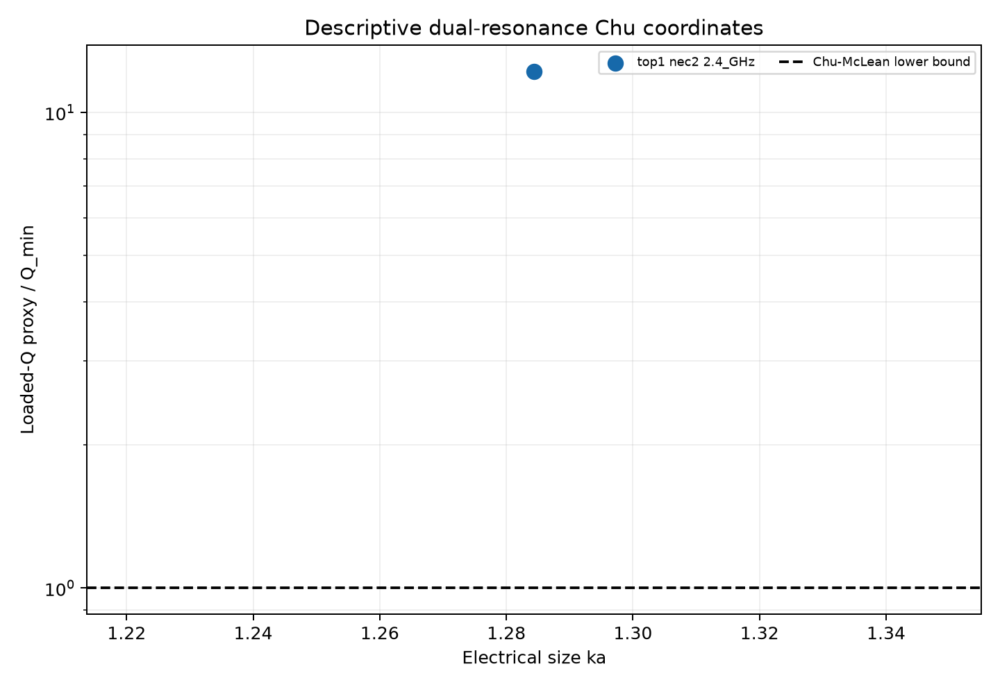

# Day 6 free-form 3D wire dual-band result

Final verdict: `insufficient_evidence`.

## Frozen references and batch

OCFD `day6-freeform-ocfd-grid` score: 0.617137421. Straight control `day6-freeform-straight-control` score: 0.100343450.

| agent | seed | best score | 2.4 GHz S11 | 5.8 GHz S11 | elapsed | source |
|---|---:|---:|---:|---:|---:|---|
| gp | 101 | 0.526974590 | -4.098670 dB | -3.251155 dB | 964.918 s | `day6-freeform-dual-gp-s101` step 102 |
| gp | 202 | 0.725916432 | -12.480313 dB | -5.621170 dB | 1037.592 s | `day6-freeform-dual-gp-s202` step 193 |
| gp | 303 | 0.548583625 | -3.555924 dB | -3.454227 dB | 968.843 s | `day6-freeform-dual-gp-s303` step 36 |
| gp | 404 | 0.580756761 | -3.775339 dB | -7.062343 dB | 993.232 s | `day6-freeform-dual-gp-s404` step 31 |
| gp | 505 | 0.647119574 | -5.294917 dB | -4.523724 dB | 1032.642 s | `day6-freeform-dual-gp-s505` step 128 |
| random | 101 | 0.667386143 | -4.780597 dB | -4.810571 dB | 980.524 s | `day6-freeform-dual-random-s101` step 99 |
| random | 202 | 0.713876506 | -7.493395 dB | -5.434465 dB | 879.536 s | `day6-freeform-dual-random-s202` step 65 |
| random | 303 | 0.630947897 | -8.986684 dB | -4.329123 dB | 886.725 s | `day6-freeform-dual-random-s303` step 169 |
| random | 404 | 0.622996038 | -5.162932 dB | -4.236541 dB | 947.055 s | `day6-freeform-dual-random-s404` step 164 |
| random | 505 | 0.422863044 | -5.083246 dB | -2.387211 dB | 873.910 s | `day6-freeform-dual-random-s505` step 62 |

Descriptive aggregate only (n=5; no significance claim):

- gp: 0.605870196 +/- 0.081008583 sample SD.
- random: 0.611613926 +/- 0.111465719 sample SD.

Paired GP-minus-random differences: seed 101: -0.140411553, seed 202: +0.012039926, seed 303: -0.082364272, seed 404: -0.042239276, seed 505: +0.224256530.

## openEMS 5.8 GHz self-convergence

| refinement | f_min | S11 | elapsed | shift | source |
|---:|---:|---:|---:|---:|---|
| 1x | 5.780 GHz | -0.710024 dB | 577.187 s | None | `day6-freeform-openems-convergence-1x` |
| 2x | 5.760 GHz | -0.642503 dB | 648.235 s | 0.003472222222222222 | `day6-freeform-openems-convergence-2x` |

Instrument status: `self_convergence_not_established`; frozen refinement None at the unchanged 3.0% adjacent-shift threshold. At least one adjacent mesh curve has no v2.1-valid 5.8 GHz resonance (local interior minimum deeper than or equal to -6 dB); the shallow-minimum position shift is descriptive only.
The completed top-2 curves are retained as diagnostic evidence. Because self-convergence was not established and both final openEMS curves also fail the -6 dB resonance gate, they cannot support confirmation.

## Frozen candidates and cross-solver decisions

### Candidate top 1

Source `day6-freeform-dual-gp-s202` step 193, score 0.725916432; reference gate True. Cross-check `day6-freeform-final-crosscheck-top1`: `NO_RESONANCE_IN_BAND`; discovery `insufficient_evidence`.

- 2.4 GHz: NEC2 2.480 GHz/-10.421882 dB; openEMS 2.440 GHz/-0.642503 dB; gap None.
- 5.8 GHz: NEC2 5.860 GHz/-5.147263 dB; openEMS 5.760 GHz/-0.642503 dB; gap None.
- Whole-sweep Pearson: None.

### Candidate top 2

Source `day6-freeform-dual-gp-s202` step 172, score 0.671870363; reference gate False. Cross-check `day6-freeform-final-crosscheck-top2`: `NO_RESONANCE_IN_BAND`; discovery `insufficient_evidence`.

- 2.4 GHz: NEC2 2.500 GHz/-4.506006 dB; openEMS 2.400 GHz/-0.432405 dB; gap None.
- 5.8 GHz: NEC2 5.860 GHz/-5.865571 dB; openEMS 5.740 GHz/-0.425619 dB; gap None.
- Whole-sweep Pearson: None.

## Cross-check anomaly attribution

- Top 1 `day6-freeform-final-crosscheck-top1`: NEC2 peak-to-peak S11 span 10.328746697 dB; openEMS span 5.21804821574e-15 dB (numerically-flat threshold 1e-06 dB; near-flat diagnostic threshold 0.05 dB; numerically flat=True; near flat=True). Classification: `link_or_geometry_coupling_anomaly`.
- Top 2 `day6-freeform-final-crosscheck-top2`: NEC2 peak-to-peak S11 span 15.160536643 dB; openEMS span 0.0100212842101 dB (numerically-flat threshold 1e-06 dB; near-flat diagnostic threshold 0.05 dB; numerically flat=False; near flat=True). Classification: `link_or_geometry_coupling_anomaly`.

Both openEMS curves are physically near-flat while the source-matched NEC2 curves contain large notches. The emitted XML uses the installed CSXCAD finite-radius `Wire`/`Vertex` schema and unit tests verify point order, but this end-to-end result does not establish that the free-form conductor coupled to the lumped port in openEMS. The classification is therefore a model-chain anomaly, not evidence of a genuine physical disagreement. No additional design or solver retry was selected after seeing the result.

## Geometry and Chu positioning

The 3D residual is descriptive only; it is not evidence of novelty. Chu rows reuse the pre-registered loaded-Q proxy independently around both target resonances. Low-confidence or ineligible fits remain in `summary.json` and are omitted from the Chu plot.

- Top 1 (`day6-freeform-dual-gp-s202`): length 472.676093 mm; enclosing radius 24.716213 mm; planarity RMS 5.971323 mm (0.241595 of radius).
- Top 2 (`day6-freeform-dual-gp-s202`): length 477.669034 mm; enclosing radius 30.465422 mm; planarity RMS 8.344264 mm (0.273893 of radius).

